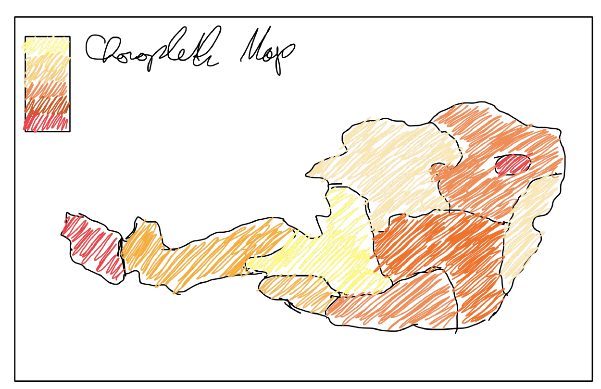

## Part 1: Project Proposal

### Topic: "Can Young People Still Afford to Live in Austrian Cities (e.g. for studying, moving out, etc.)?"

This is honestly a problem that affects a lot of people our age. Rents in Vienna and other Austrian cities have gone up like crazy over the past decade, especially after COVID, while people's salaries haven't really caught up. It's basically impossible to buy property without a huge loan and a really stable job-which is hard enough to find these days. Even renting feels impossible for students or people just starting out. We wanted to visualize this problem and show how much harder it's gotten to afford a place to live over time.

### The Data we are Using

We're using data from official Austrian government sources:

- **Rental prices by district** from [wien.gv.at](https://www.wien.gv.at/statistik/gebaeude-wohnungen) - we can see which areas in Vienna are most expensive
- **Housing costs across Austria** from [statistik.at](https://www.statistik.at/statistiken/bevoelkerung-und-soziales/wohnen/wohnkosten) - to compare Vienna to other Austrian cities
- **Income and wage data** from [Statistics Austria](https://www.statistik.at/statistiken/bevoelkerung-und-soziales/einkommen-und-soziale-lage/allgemeiner-einkommensbericht) - to see if young people's salaries actually match what they pay for rent
- **Inflation data (CPI/HVPI)** from [Statistics Austria](https://www.statistik.at/statistiken/volkswirtschaft-und-oeffentliche-finanzen/preise-und-preisindizes/verbraucherpreisindex-vpi/hvpi) and [STATCUBE (2015-2025)](https://statcube.at/statistik.at/ext/statcube/openinfopage?tableId=VPI_2015COICOP18_T01_devpi15c18) - so we can adjust everything for inflation and see real values over time, not just the raw numbers
- **Population and student demographics** from [Statistics Austria](https://www.statistik.at/statistiken/bevoelkerung-und-soziales/bevoelkerung) - to understand how demand is driving prices up

All of this data is publicly available and gets updated regularly, so it's reliable for our project.

### Who's This For?

Our main audience is obviously young people (18-35) who are actually dealing with this-students, early-career workers, basically anyone trying to find a place to live in Austria, especially Vienna.

But we also think journalists and people researching housing policy would find this useful to show other people what's really happening. So the visualization has to work for both groups: it should be easy to understand for regular people, but detailed enough that researchers can dig deeper. We're planning interactive features with filters and a timeline so people can explore the data themselves.

### The Story We Want to Tell

The basic question is: can young people actually afford to live in Austria? We want to tell the story in stages:

1. **First, show how bad it is** - a time-series of rent vs. income over like 10-15 years so people see the gap growing
2. **Then show where it's worst** - a map of Vienna showing which districts are most expensive (looking at rent-to-income ratio)
3. **Then focus on who's most affected** - students and entry-level workers, comparing their salary to what they actually pay for rent
4. **Finally, what's the context?** - talk about why this is happening and what could change it

The cool thing is our data lets us tell both the big story (affordability across Austria over time) and the local story (which Vienna districts are actually livable). We think interactive exploration is perfect for this-people can see the overview but also dig into specific years, cities, and neighborhoods.

### The Main Question
How has it gotten harder or easier for young people (18-35) to afford rent in Austrian cities over the past decade? Which groups are hit the hardest? Our data lets us compare rent to income (adjusted for inflation) across different years and places. So we can show where the gap is growing fastest, which Vienna neighborhoods young renters can still afford, and whether students or entry-level workers are getting hit worse. The visualization will tell a clear story about the problem but also let people explore the data themselves-looking at specific years, cities, and districts.

## Part 2: Design Sketches

## Design Rationale

### Design Process

We used Figma with low-fidelity wireframes and pen-and-paper sketches to maintain a lightweight, iterative approach. Through collaborative discussions about interactivity and user engagement, we developed the following structural framework.

### Views & Navigation

The project consists of **4 main views**, navigated linearly (with the option to jump back):

1. **Landing / Input View** - The entry point where users provide their age and salary before proceeding.
2. **Personal Overview View** - Shows where the user stands relative to others of the same age and income bracket across multiple decades.
3. **Cost of Living View** - Breaks down how spending categories (housing, food, energy, etc.) have evolved over time and their share of disposable income.
4. **Geographic View** - Visualizes how rent prices have shifted settlement patterns across regions, with a possible timeline slider to compare years.

A **persistent bottom navigation bar** allows users to move freely between views after completing the input step or just scrolling down the websites with some animations.

For wireframes we also used google sheets. The values do not represent acutal values - we here want to inform you that these values are completely random generated using math.random() from js and casting to an integer and ajusted to reach a meaningful format.

### Visualizations per View

| View | Visualization Type | Interactive |
|---|---|---|
| Landing | Input form + animated intro | Yes - required user input |
| Personal Overview | Line chart (salary vs. cost of living over decades), percentile indicator | Yes - year slider |
| Cost of Living | Stacked area / grouped bar chart, % of salary used for living costs | Yes - toggle categories |
| Geographic | Choropleth map (rent price evolution by region) | Potentially yes - timeline slider |

So to sum up in general 3 to 4 elements with user providing information at the beginnen - the salary can be given as a range for example or a single value - we'll have to try both to see what works better.

### Design Rationale

We set up the four-view structure to guide people through the problem in a way that actually feels personal and relevant. The **Landing View** asks for age and salary right at the start-this connects the housing crisis to the user's own situation instead of making it feel abstract. For our target audience of young people actually looking for apartments, this makes a big difference.

The **Personal Overview View** uses a line chart comparing salary over time to living costs, so you can actually *see* the gap growing. A year slider lets people explore without getting overwhelmed-they can see how their situation compares to their parents' time. The **Cost of Living View** breaks down where the money goes (housing, food, energy, etc.), so people understand not just that stuff is expensive, but *why*-mainly because housing takes up so much of the budget. The **Geographic View** gives practical info: which Vienna districts are still actually affordable? We may add a small timeline slider there as well, so users can compare how district-level affordability changes over time. This helps both people looking for apartments and journalists/researchers trying to make the case to policymakers.

The navigation bar at the bottom lets people jump between views freely, which balances our storytelling (showing the problem clearly) with letting people explore on their own (if they want to dig deeper). We put interactive elements (sliders, toggles) on views where people actually need to interact, while the map is static so it's less overwhelming. This way, someone in a hurry can get the main story, but researchers or journalists can explore as much as they want.
